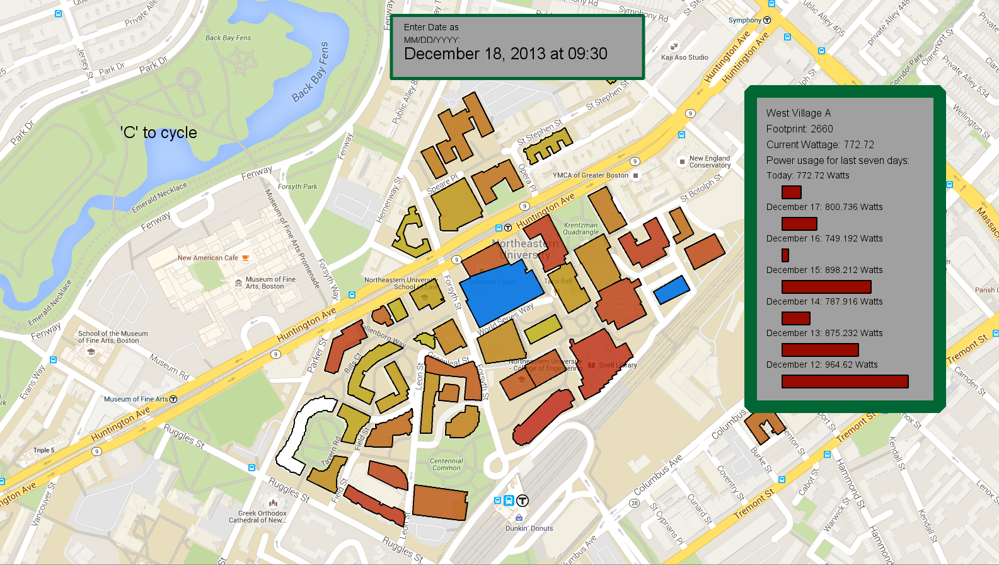

# PowerUsage

A map of Northeastern University's campus that visualizes the campus' power readings over a year. Color codes the energy usage from yellow to red to indicate the main users of energy, and blue to indicate buildings with downed power meters. Can cycle through the year to understand usage of power over time.

To run it yourself, clone the repo and simply open the VisualizationMap jar in the out directory. 
